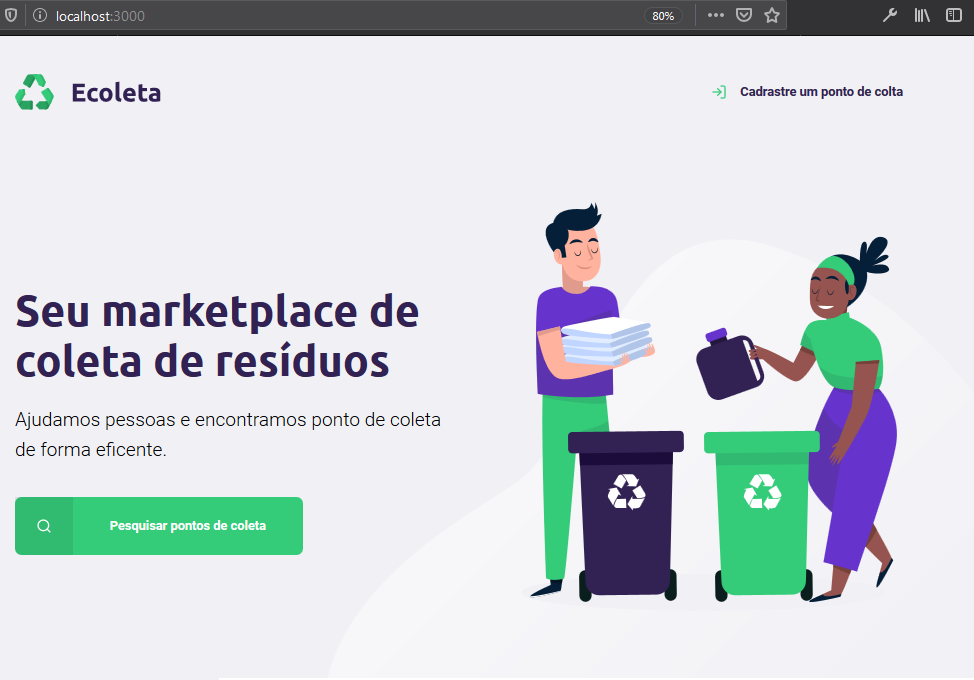
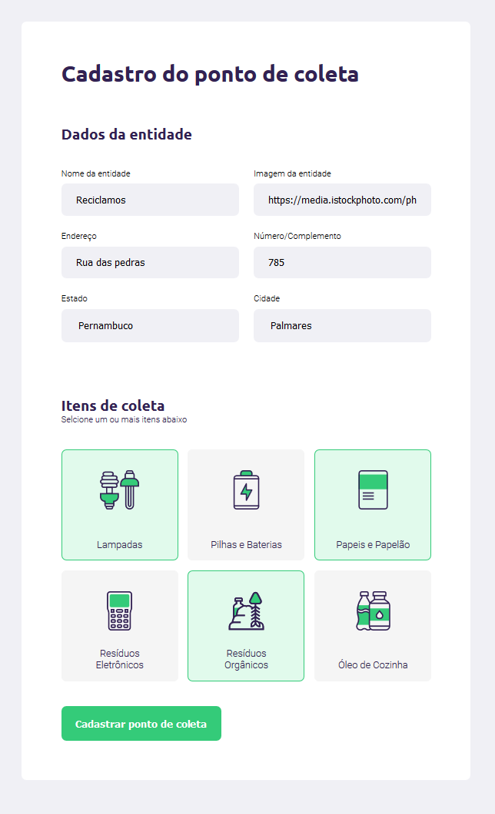

## Projeto Ecoleto feito na semana Next Level Week 1 da Rocketseat com Nodejs no backend, HTML, CSS e JavaScript no frontend e  banco de dados Sqlite3 .

O sistema foi pensado para unificar informações sobre a localização de pontos de coleta de reciclagem, organizados por cidades e itens de coletas, como papel, vidro, resíduos orgânicos e eletrônicos. 

<p align='center'>
  
</p>
Tela de Cadastro os pontos de coletas.  
<p>
  
</p>

Durante o curso pude trabalhar bastante com CSS e JavaScript para o front-end e o backend construido em nodejs para servir as informações.

## Tecnologias
- HTML
- CSS
- JavaScrip
- Node.js
- NPM
- Express
- Nodemon
- SQLite3
- Nunjucks

## Node.js no back-end

Para rodar o servidor execute;
```node
nmp start
```

## JavaScrip, CSS e HTML no front-end

Para a organização do nosso template foi separado cado parte do código HTML que se repetia em vários arquivos como modal, header etc... Utilizamos o Nunjucks que é uma templating engine, uma forma de nós renderizamos e manipularmos Html com conteúdo Javascript facilmente. Fizemos uso da api do IBGE para obtém o conjunto de municípios do Brasil a partir dos identificadores das Unidades da Federação.


## Licença
[MIT](https://choosealicense.com/licenses/mit/)
